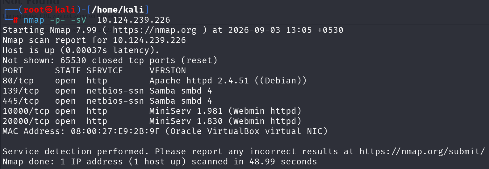
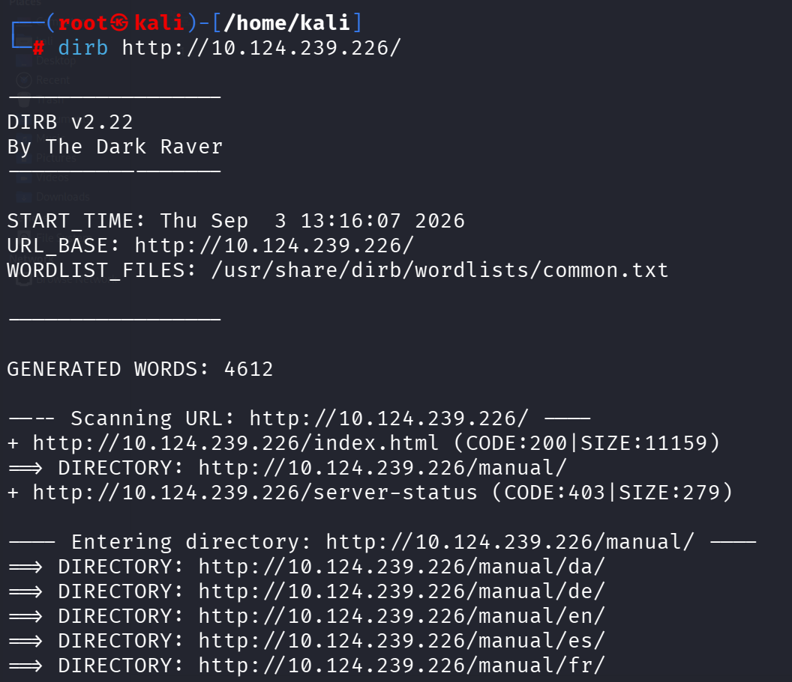
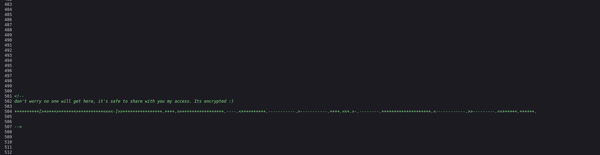
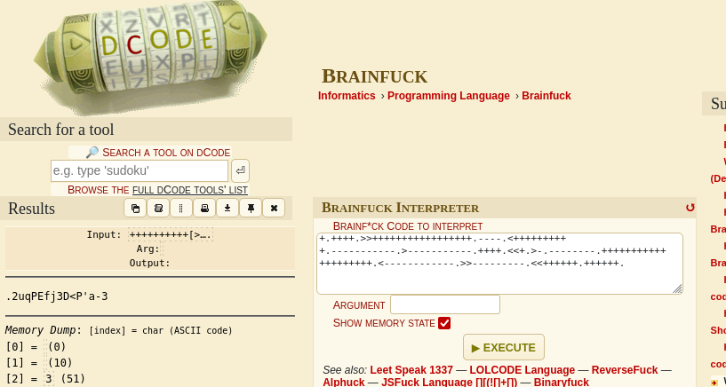
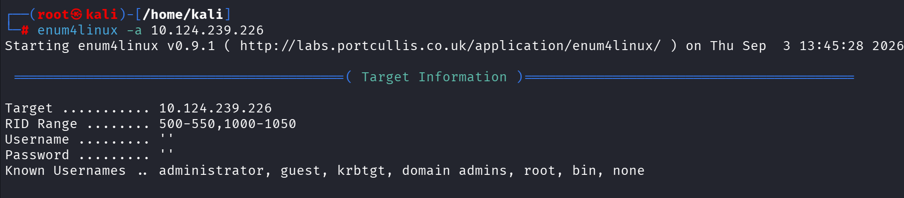
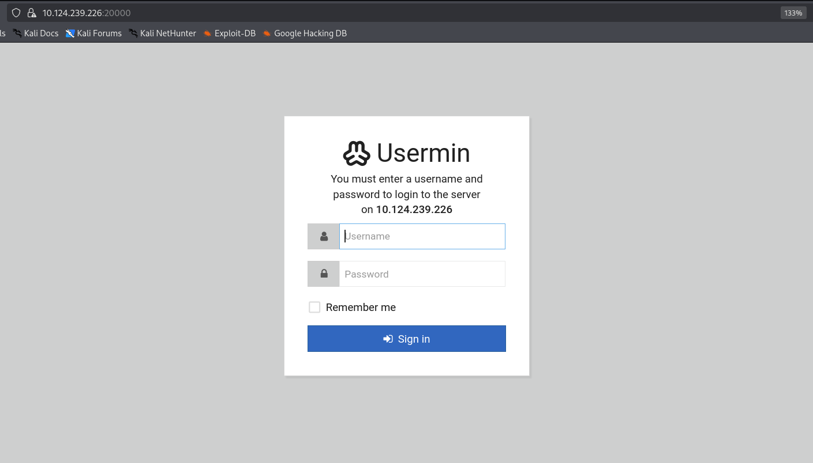
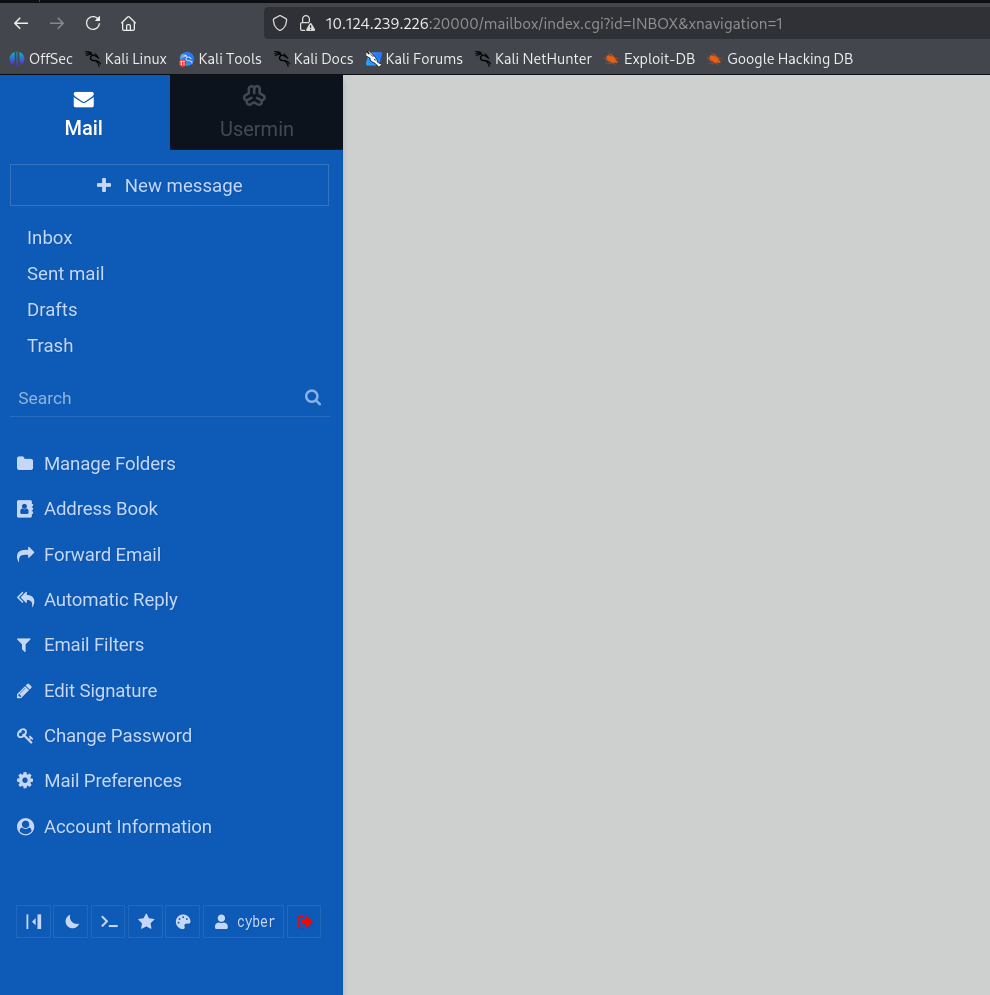
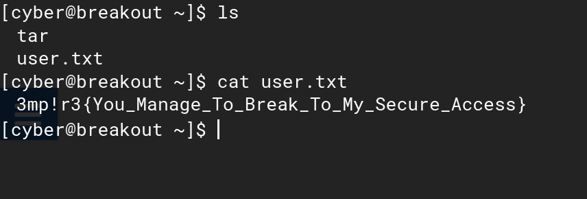

# Empire: Breakout — VulnHub CTF Write-up

## Overview

This write-up documents my penetration testing practice on **Empire: Breakout**, a deliberately vulnerable Linux machine from VulnHub.

The objective was to perform reconnaissance and enumeration, identify a path to initial access, authenticate to the target, and retrieve the user-level flag.

This lab helped me practice:

* Network reconnaissance
* Service enumeration
* Web enumeration
* HTML source-code inspection
* Credential discovery
* Brainfuck decoding
* SMB/NetBIOS enumeration
* Authentication testing
* User-level post-exploitation

> **Lab:** VulnHub — Empire: Breakout
> **Difficulty:** Easy
> **Attacking OS:** Kali Linux
> **Lab Type:** Boot-to-Root CTF

---

## Attack Path

```text
Nmap
  ↓
Port 80 Web Enumeration
  ↓
HTML Source Code Inspection
  ↓
Hidden Brainfuck Credential
  ↓
Brainfuck Decoding
  ↓
enum4linux SMB Enumeration
  ↓
Username: cyber
  ↓
Usermin (Port 20000)
  ↓
Authenticated Console
  ↓
user.txt
```

---

# 1. Reconnaissance

I started with a full TCP port scan with service and version detection.

```bash
nmap -p- -sV <TARGET_IP>
```

The scan identified several interesting services:

* HTTP — TCP/80
* SMB — TCP/139
* SMB — TCP/445
* Webmin — TCP/10000
* Usermin — TCP/20000

These services provided several possible enumeration paths.

### Screenshot



---

# 2. Web Enumeration

I performed directory enumeration against the HTTP service using Dirb.

```bash
dirb http://<TARGET_IP>/
```

The scan did not reveal an obvious application or useful hidden directory.

However, the HTTP service itself became interesting during manual inspection.

### Screenshot



---

# 3. HTML Source Code Inspection

Since the website did not expose anything useful through normal browsing, I inspected the HTML source code.

A hidden HTML comment contained an encoded credential.

The string contained characters such as:

```text
+ - < > .
```

This pattern suggested that the data was written in **Brainfuck**, an esoteric programming language.

This was an important lesson: information can sometimes be hidden in client-visible HTML comments even when it is not displayed on the webpage.

### Screenshot



---

# 4. Brainfuck Decoding

The discovered Brainfuck string was decoded using a Brainfuck interpreter.

The decoded password was:

```text
[REDACTED]
```

The important takeaway is that encoding or obfuscation should not be treated as encryption.

Anything delivered to the client can potentially be inspected and recovered.

### Screenshot



---

# 5. SMB Enumeration

Next, I enumerated the SMB service using enum4linux.

```bash
enum4linux -a <TARGET_IP>
```

The enumeration revealed a valid local username:

```text
cyber
```

This provided the username needed to test the previously recovered credential.

### Screenshot



---

# 6. Initial Access — Usermin

The reconnaissance phase had identified Usermin running on:

```text
TCP/20000
```

I accessed the Usermin login interface and tested the recovered credentials.

The credentials were accepted, providing an authenticated Usermin session for the `cyber` account.

### Screenshot



---

# 7. Authenticated Console

Usermin provided access to an interactive console as the `cyber` user.

From the console, I inspected the user's home directory.

```bash
ls
```

The directory contained:

```text
tar
user.txt
```

I then read the user flag:

```bash
cat user.txt
```

### Screenshot



---

# 8. User Flag

The `user.txt` file contained the user-level flag.

```text
[FLAG REDACTED]
```

### Screenshot



---

# 9. Key Findings

The main weaknesses identified during this lab were:

| Finding                | Description                                                           |
| ---------------------- | --------------------------------------------------------------------- |
| Information Disclosure | Credential information was exposed inside an HTML comment             |
| Weak Obfuscation       | Brainfuck was used as obfuscation instead of proper secret protection |
| SMB Enumeration        | SMB allowed discovery of a valid local username                       |
| Exposed Usermin        | Usermin was accessible through TCP/20000                              |
| Password Reuse         | The recovered credential worked for the discovered account            |

The complete compromise path relied primarily on information disclosure, enumeration, and credential reuse rather than a memory-corruption exploit or custom exploit development.

---

# 10. Lessons Learned

This machine helped reinforce several practical penetration-testing concepts:

* Always perform complete port enumeration.
* Inspect HTML source code manually.
* Do not assume that hidden comments are harmless.
* Recognize common encoding and obfuscation patterns.
* Enumerate SMB for usernames and other information.
* Test recovered credentials against discovered services in an authorized lab.
* Treat exposed administration panels as high-value attack surfaces.
* Avoid password reuse between services.

---

# 11. Tools Used

* Nmap
* Dirb
* enum4linux
* Web Browser
* HTML source inspection
* Brainfuck interpreter
* Usermin

---

## Disclaimer

This write-up was created for **educational and authorized penetration-testing practice** on a deliberately vulnerable VulnHub machine.

The techniques demonstrated here should only be used against systems for which you have explicit permission to test.
